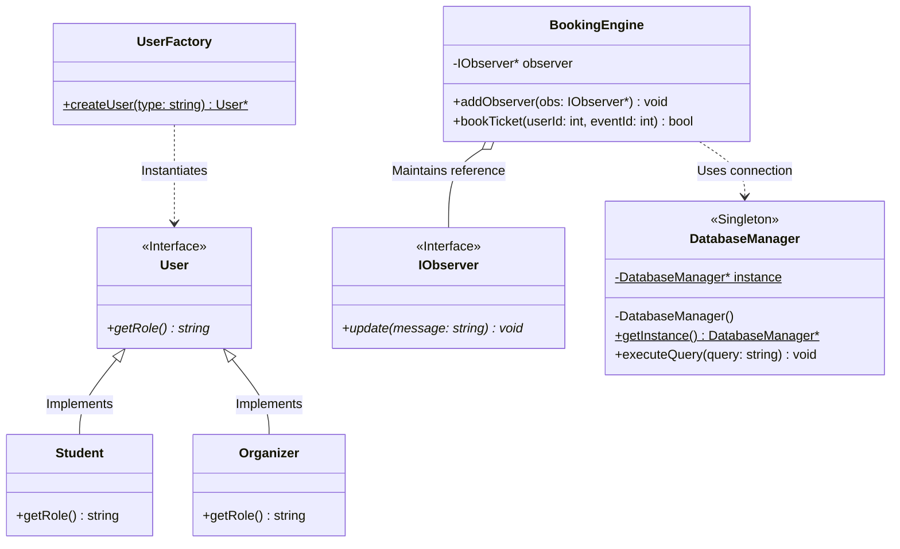

# Campus Event Management System

This project uses TDD and Design Patterns.

## UML Class Diagram

```mermaid
classDiagram
    class DatabaseManager {
        <<Singleton>>
        -DatabaseManager* instance$
        -DatabaseManager()
        +getInstance()$ DatabaseManager*
        +executeQuery(query: string) void
    }

    class User {
        <<Interface>>
        +getRole()* string
    }

    class Student {
        +getRole() string
    }

    class Organizer {
        +getRole() string
    }

    class UserFactory {
        +createUser(type: string)$ User*
    }

    class IObserver {
        <<Interface>>
        +update(message: string)* void
    }

    class BookingEngine {
        -IObserver* observer
        +addObserver(obs: IObserver*) void
        +bookTicket(userId: int, eventId: int) bool
    }

    User <|-- Student : Implements
    User <|-- Organizer : Implements
    UserFactory ..> User : Instantiates

    BookingEngine o-- IObserver : Maintains reference
    BookingEngine ..> DatabaseManager : Uses connection
```